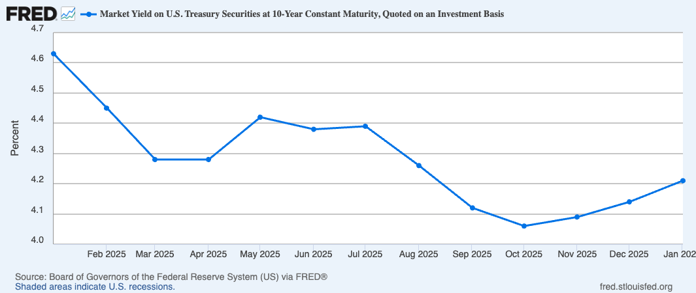

# Fred St Louis MCP


*Author*: Nicolo Ceneda \
*Contact*: n.ceneda20@imperial.ac.uk \
*Website*: [nicoloceneda.github.io](https://nicoloceneda.github.io/) \
*Institution*: Imperial College London \
*Course*: PhD in Finance

## Description

This repository provides an MCP server that lets MCP-compatible clients query and explore economic data from [FRED](https://fred.stlouisfed.org/). It exposes structured tools for common workflows (searching series, retrieving observations, browsing categories/releases/tags) and also supports raw endpoint passthrough for advanced use cases.

Supported APIs:
- FRED API v1 (`/fred/*`)
- GeoRE maps API (`/geofred/*`)
- FRED API v2 (`/fred/v2/*`)

## Requirements

- Python `>=3.11`
- A FRED API key from [FRED API Keys](https://fred.stlouisfed.org/docs/api/api_key.html)

## Installation Step 1: Cloning and APY Key

First, `cd` into the directory where you want the `mcp-fred` repository to be created. Then execute the following commands from the terminal.

```bash
git clone https://github.com/nicoloceneda/mcp-fred.git
cd mcp-fred
python3 -m venv .venv
.venv/bin/pip install -e .
```

Create a local `.env`:

```bash
cp .env.example .env
```

Then set:

```dotenv
FRED_API_KEY=your_fred_api_key_here
```

## Installation Step 2: Configure MCP clients

### Codex CLI

Run once (note: you need to replace `/absolute/path/to/` with your actual path):

```bash
codex mcp add fred -- /absolute/path/to/mcp-fred/.venv/bin/python /absolute/path/to/mcp-fred/fred_server.py
```

Check:

```bash
codex mcp list
codex mcp get fred
```

Successful setup should show:
- In `codex mcp list`: `fred` with `Status` = `enabled`
- In `codex mcp get fred`: `enabled: true`

Launch Codex (`codex`) and verify that the MCP has successfully been installed (`/mcp`).

### Generic `mcpServers` JSON config

Use this when your MCP client expects a JSON-based manual server configuration instead of `codex mcp add`.

```json
{
  "mcpServers": {
    "fred": {
      "command": "/absolute/path/to/mcp-fred/.venv/bin/python",
      "args": ["/absolute/path/to/mcp-fred/fred_server.py"],
      "env": {
        "FRED_API_KEY": "your_fred_api_key_here"
      }
    }
  }
}
```

## Optional quick smoke test

<details>
<summary>Show optional smoke test script</summary>

Run this script to verify that the MCP server starts, the stdio MCP connection initializes correctly, and a real tool call (`search_series`) succeeds.

```bash
cd mcp-fred
.venv/bin/python - <<'PY'
import asyncio
from mcp import ClientSession, StdioServerParameters
from mcp.client.stdio import stdio_client

async def main():
    params = StdioServerParameters(
        command=".venv/bin/python",
        args=["fred_server.py"],
    )
    async with stdio_client(params) as (r, w):
        async with ClientSession(r, w) as s:
            await s.initialize()
            tools = await s.list_tools()
            print("tool_count =", len(tools.tools))
            out = await s.call_tool("search_series", {"query": "unemployment rate", "limit": 1})
            print(out.content[0].text)

asyncio.run(main())
PY
```

</details>

## Examples

<details>
<summary>Calling MCP explicitly and with Series ID specified.</summary>

```text
$ codex
OpenAI Codex (v0.101.0)
model: gpt-5.3-codex xhigh
directory: ~

> Use the FRED MCP to retrieve the last 13 values of GS10.

I’ll query the FRED MCP fred/series/observations endpoint for GS10 with limit=13 and descending order so we get the most recent 13 observations directly.

Called fred.get_observations({"series_id":"GS10","limit":13,"sort_order":"desc"})
```

Most recent 13 GS10 observations from [FRED](https://fred.stlouisfed.org/) (newest first, percent):

| Date | Value |
|---|---:|
| 2026-01-01 | 4.21 |
| 2025-12-01 | 4.14 |
| 2025-11-01 | 4.09 |
| 2025-10-01 | 4.06 |
| 2025-09-01 | 4.12 |
| 2025-08-01 | 4.26 |
| 2025-07-01 | 4.39 |
| 2025-06-01 | 4.38 |
| 2025-05-01 | 4.42 |
| 2025-04-01 | 4.28 |
| 2025-03-01 | 4.28 |
| 2025-02-01 | 4.45 |
| 2025-01-01 | 4.63 |

You can see that this matches the data available on FRED.



</details>

<details>
<summary>Without calling MCP explicitly and no Series ID specified.</summary>

```text
$ codex
OpenAI Codex (v0.101.0)
model: gpt-5.3-codex xhigh
directory: ~

> Tell me the latest value of US GDP (nominal).

I’ll pull the most recent GDP observation from FRED now and report its date and value.

Called fred.get_observations({"series_id":"GDP","limit":1,"sort_order":"desc"})
```

Latest FRED nominal U.S. GDP (GDP) is 31,098.027 (billions of dollars, SAAR), for 2025-07-01 (i.e., 2025 Q3).

</details>

## Functionality and endpoint coverage

The server includes both dedicated tools and generic passthrough tools.

<details>
<summary>Generic passthrough</summary>

- `fred_request(endpoint, params_json)` for `/fred/*`
- `geofred_request(endpoint, params_json)` for `/geofred/*`
- `fred_v2_request(endpoint, params_json)` for `/fred/v2/*`

</details>

<details>
<summary>FRED categories</summary>

- `get_category` -> `fred/category`
- `get_category_children` -> `fred/category/children`
- `get_category_related` -> `fred/category/related`
- `get_category_series` -> `fred/category/series`
- `get_category_tags` -> `fred/category/tags`
- `get_category_related_tags` -> `fred/category/related_tags`

</details>

<details>
<summary>FRED releases</summary>

- `get_releases` -> `fred/releases`
- `get_releases_dates` -> `fred/releases/dates`
- `get_release` -> `fred/release`
- `get_release_dates` -> `fred/release/dates`
- `get_release_series` -> `fred/release/series`
- `get_release_sources` -> `fred/release/sources`
- `get_release_tags` -> `fred/release/tags`
- `get_release_related_tags` -> `fred/release/related_tags`
- `get_release_tables` -> `fred/release/tables`

</details>

<details>
<summary>FRED series</summary>

- `get_series` -> `fred/series`
- `get_series_categories` -> `fred/series/categories`
- `get_observations` -> `fred/series/observations`
- `get_series_observations` -> alias of `get_observations`
- `get_series_release` -> `fred/series/release`
- `search_series` -> `fred/series/search`
- `search_series_by_tags` -> `fred/series/search/tags`
- `search_series_related_tags` -> `fred/series/search/related_tags`
- `get_series_tags` -> `fred/series/tags`
- `get_series_updates` -> `fred/series/updates`
- `get_series_vintage_dates` -> `fred/series/vintagedates`

</details>

<details>
<summary>FRED sources</summary>

- `get_sources` -> `fred/sources`
- `get_source` -> `fred/source`
- `get_source_releases` -> `fred/source/releases`

</details>

<details>
<summary>FRED tags</summary>

- `get_tags` -> `fred/tags`
- `get_related_tags` -> `fred/related_tags`
- `get_tag_series` -> `fred/tags/series`

</details>

<details>
<summary>GeoFRED maps</summary>

- `get_map_shape_file` -> `geofred/shapes/file`
- `get_map_series_group` -> `geofred/series/group`
- `get_map_series_data` -> `geofred/series/data`
- `get_map_regional_data` -> `geofred/regional/data`

</details>

<details>
<summary>FRED v2</summary>

- `get_release_observations_v2` -> `fred/v2/release/observations`

</details>
